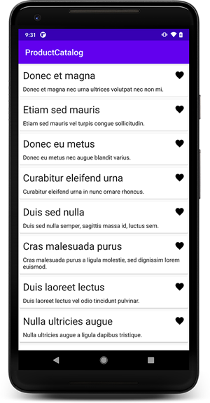

# Android application written in Kotlin

[](https://creativecommons.org/licenses/by-nd/4.0)


This project is an android application to showcase [Jetpack libraries](https://d.android.com/jetpack).
As buildsystem the [Gradle’s Kotlin DSL](https://docs.gradle.org/current/userguide/kotlin_dsl.html) is used.

 * [View Binding](https://developer.android.com/topic/libraries/view-binding)
 * [Data Binding](https://developer.android.com/topic/libraries/data-binding)
 * [Lifecycles](https://developer.android.com/topic/libraries/architecture/lifecycle)
 * [LiveData](https://developer.android.com/topic/libraries/architecture/livedata)
 * [Paging](https://developer.android.com/topic/libraries/architecture/paging/)
 * [Room](https://developer.android.com/topic/libraries/architecture/room)
 * [ViewModel](https://developer.android.com/topic/libraries/architecture/viewmodel)
 * [WorkManager](https://developer.android.com/topic/libraries/architecture/workmanager)
 * [Dynamic Feature Module](https://developer.android.com/guide/app-bundle/dynamic-delivery)




## Table of contents

* [Getting started](#getting-started)
  * [Prerequisites](#prerequisites)
* [Library usage](#library-usage)
* [Contribution](#contribution)
* [License](#license)


## Getting started
#### Prerequisites
The Android SDK needs to be installed.
The included gradle wrapper inside the project will download all required libraries during the build.

## Library usage
#### Data Binding

Products are binded into the recyclerview via one-way binding inside the `ProductViewHolder`

#### Paging

Paging is used to load more items when you scroll to the bottom of the list. Its limited to 8 items to force the reload.

#### WorkManager

## Installation

To build and run the app on and android device or emulator, use the included gradle wrapper:

```sh
./gradlew installDebug
```

## Contributing

1. Fork it (https://github.com/thebino/ProuctCatalog/fork>)
2. Create your feature branch (`git checkout -b feature/fooBar`)
3. Commit your changes (`git commit -am 'Add some fooBar'`)
4. Push to the branch (`git push origin feature/fooBar`)
5. Create a new Pull Request

## License
Stürmer Benjamin – [@BenjaminStrmer](https://twitter.com/BenjaminStrmer) – webmaster@stuermer-benjamin.de

<a rel="license" href="http://creativecommons.org/licenses/by-sa/4.0/"></a><br />This work is licensed under a <a rel="license" href="http://creativecommons.org/licenses/by-sa/4.0/">Creative Commons Attribution-ShareAlike 4.0 International License</a>.
